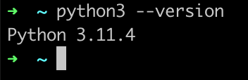
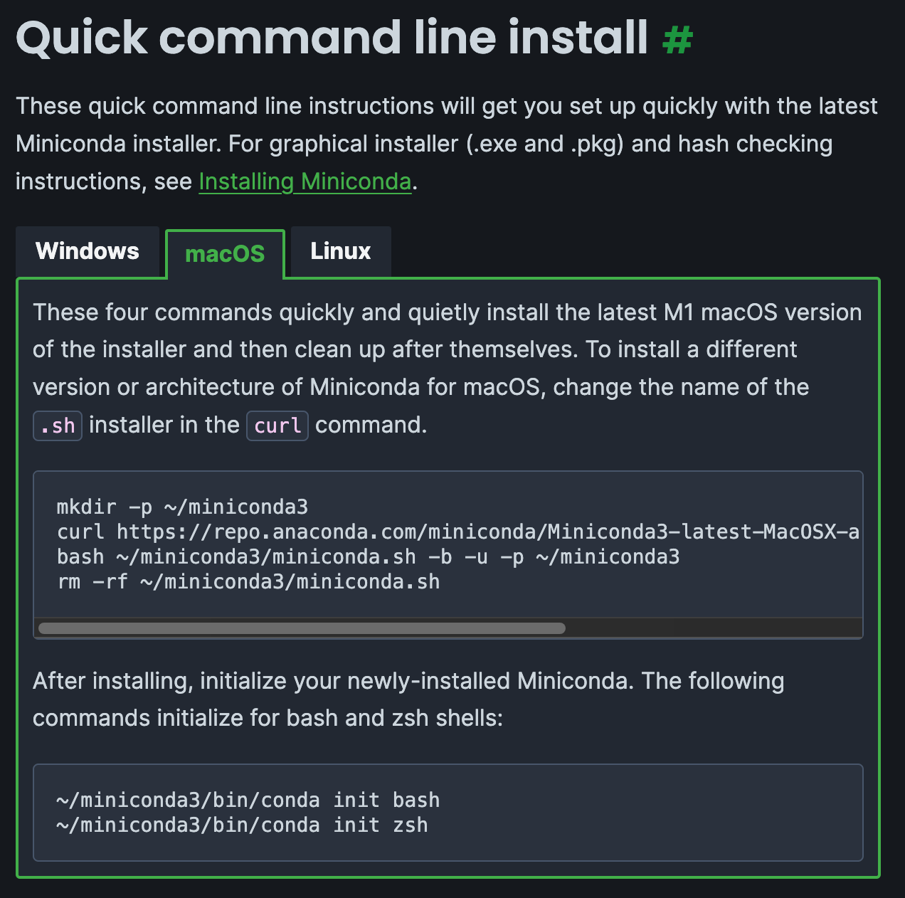
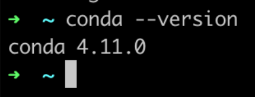
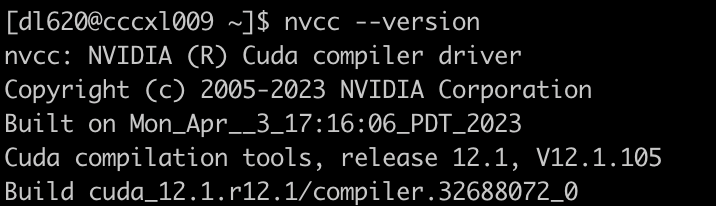

# Introduction

- **Python** is a versatile and widely used programming language known for its simplicity and readability. 
- **Conda** is a package manager and environment management system.
- **PyTorch**, a popular open-source deep learning library, is designed to provide flexibility and ease of use for researchers and developers. 

This document will guide you through the installation of Python and PyTorch, setting up a development environment with conda, and demonstrate how to train a simple model on the dataset using PyTorch.

---

# Python

## Install Python

- Visit the [Python Downloads](https://www.python.org/downloads/) page.
- Download the installer for your operating system (**Windows, macOS, Linux**).

## Verify Installation

- Open a terminal or command prompt.

- Type `python3 --version` to verify the installation.

  

## Additional Material

- **Syntax:**[ https://docs.python.org/3/tutorial/introduction.html](https://docs.python.org/3/tutorial/introduction.html)

- **Google Python Writing Style**: https://google.github.io/styleguide/pyguide.html

## Useful Packages

- **NumPy** (for data processing on CPU)**:**[ https://numpy.org/doc/stable/user/absolute_beginners.html](https://numpy.org/doc/stable/user/absolute_beginners.html)
  - **CuPy** (GPU alternative to NumPy): [https://cupy.dev/ ](https://cupy.dev/)
- **Matplotlib** (for plotting)**:**[ https://matplotlib.org/stable/users/explain/quick_start.html](https://matplotlib.org/stable/users/explain/quick_start.html)

---

# Miniconda

## Install Miniconda

- Visit the [Miniconda Downloads](https://docs.anaconda.com/free/miniconda/) page.

- Download the installer for your operating system (Windows, macOS, Linux).



- Ensure that you **check the option to add Miniconda to your PATH environment variable** during the installation.

- Open a terminal or command prompt. Type `conda --version` to verify the installation.

  

## Setting Up Conda Environment

1. Create a New Environment

   ```bash
   conda create --name YOUR_ENV_NAME
   ```

Replace YOUR_ENV_NAME with your environment name.

2. Activate (deactivate) the Environment

   ```bash
   conda activate YOUR_ENV_NAME
   conda deactivate YOUR_ENV_NAME
   ```

3. To install a new package

   ```bash
   conda install YOUR_PACKAGE_NAME
   ```
   e.g., `conda install numpy`
   
   Alternatively, you can use pip to install packages that are not supported by conda install:

   ```bash
   pip install YOUR_PACKAGE_NAME
   pip3 install YOUR_PACKAGE_NAME
   ```

---

# PyTorch

## Installing [PyTorch](https://pytorch.org/get-started/locally/)

PyTorch can be installed with different configurations depending on whether you want to use CPU or GPU for computations. Here are the steps for both installations:

### CPU Installation

If you don't have a compatible GPU or don't need to use GPU acceleration, you can install the CPU-only version of PyTorch.

1. **Open a terminal or command prompt.**
3. **Install PyTorch for CPU**, e.g., on Mac:
   
    ```bash
    conda install pytorch::pytorch torchvision torchaudio -c pytorch
    ```

### GPU Installation

To leverage the power of GPU for faster computations, you can install the GPU-enabled version of PyTorch. Ensure you have the necessary NVIDIA drivers and CUDA toolkit installed on your system.

1. **Open a terminal or command prompt.**
3. **Install PyTorch with CUDA support**:
   
    - Identify the correct CUDA version for your system. You can check the installed CUDA version with the following command:
        ```bash
        nvcc --version
        ```
        
        
    - Use the appropriate installation command. For example, to install PyTorch 2.3.0 with CUDA 12.1 support:
        ```bash
        conda install pytorch torchvision torchaudio pytorch-cuda=12.1 -c pytorch -c nvidia
        ```

### Verifying the Installation
After installing PyTorch, you can verify the installation by running a simple script to check if PyTorch is working correctly.

1. **Create a new Python file or open a Python shell**:
    ```python
    import torch
    print(torch.cuda.is_available())  # This should return True if CUDA is available
    ```

If you see the PyTorch version and `True` for CUDA availability, your installation is successful.

---

# Using PyTorch with a Simple CNN on Fashion-MNIST Dataset

## Importing Libraries
First, import the necessary libraries:
```python
import torch
import torchvision
import torchvision.transforms as transforms
import torch.nn as nn
import torch.nn.functional as F
import torch.optim as optim
```
- **torch**: The core PyTorch library.
- **torchvision**: A library that provides easy access to popular datasets and common transformations.
- **torch.nn**: A module containing various neural network layers and utilities.
- **torch.nn.functional**: Provides functions for various operations like activation functions.
- **torch.optim**: Contains optimization algorithms like SGD, Adam, etc.

## Loading the Fashion-MNIST Dataset
We'll use torchvision to load and preprocess the Fashion-MNIST dataset. We'll also normalize the images:
```python
transform = transforms.Compose([
    transforms.ToTensor(),	# Converts a PIL Image or numpy.ndarray to a tensor.
    transforms.Normalize((0.5,), (0.5,))	#  Normalizes a tensor with mean and standard deviation.
])
```
Next, we load the training and test datasets:
```python
# Downloads the Fashion-MNIST dataset.
trainset = torchvision.datasets.FashionMNIST(root='./data', train=True, download=True, transform=transform)
# Provides an iterable over the given dataset.
trainloader = torch.utils.data.DataLoader(trainset, batch_size=64, shuffle=True, num_workers=2)

testset = torchvision.datasets.FashionMNIST(root='./data', train=False, download=True, transform=transform)
testloader = torch.utils.data.DataLoader(testset, batch_size=64, shuffle=False, num_workers=2)
```
- **batch_size**: Number of samples per batch.
- **shuffle**: Whether to shuffle the data at every epoch.
- **num_workers**: Number of subprocesses to use for data loading.

## Defining a Simple CNN Model
We'll define a basic CNN with a couple of convolutional layers, followed by fully connected layers:
```python
class SimpleCNN(nn.Module):
    def __init__(self):
        super(SimpleCNN, self).__init__()
        self.conv1 = nn.Conv2d(1, 32, 3, padding=1)
        self.pool = nn.MaxPool2d(2, 2)
        self.conv2 = nn.Conv2d(32, 64, 3, padding=1)
        self.fc1 = nn.Linear(64 * 7 * 7, 128)
        self.fc2 = nn.Linear(128, 10)

    def forward(self, x):
        x = self.pool(F.relu(self.conv1(x)))
        x = self.pool(F.relu(self.conv2(x)))
        x = x.view(-1, 64 * 7 * 7)
        x = F.relu(self.fc1(x))
        x = self.fc2(x)
        return x

net = SimpleCNN()
```
- **nn.Conv2d**: A convolutional layer.
- **nn.MaxPool2d**: A max pooling layer.
- **nn.Linear**: A fully connected layer.
- **F.relu**: Applies the ReLU activation function.

## Defining Loss Function and Optimizer
We'll use Cross-Entropy Loss and Stochastic Gradient Descent (SGD) as the optimizer:
```python
criterion = nn.CrossEntropyLoss()
optimizer = optim.SGD(net.parameters(), lr=0.001, momentum=0.9)
```
- **nn.CrossEntropyLoss**: Computes the cross-entropy loss between input and target.
- **optim.SGD**: Implements stochastic gradient descent.
- **lr**: Learning rate.
- **momentum**: Momentum factor.

## Training the Model
The training loop will iterate over the dataset multiple times and update the model parameters:
```python
for epoch in range(10):  # loop over the dataset 10 times
    running_loss = 0.0
    for i, data in enumerate(trainloader):
        inputs, labels = data	# get the training data

        optimizer.zero_grad()	# clear the gradients

        outputs = net(inputs)	# forward computation
        loss = criterion(outputs, labels)	# compute the loss
        loss.backward()	# backward computation to derive the gradients
        optimizer.step()	# apply the gradients

        running_loss += loss.item()
        if i % 100 == 99:    # print every 100 mini-batches
            print(f'[Epoch {epoch + 1}, Batch {i + 1}] loss: {running_loss / 100:.3f}')
            running_loss = 0.0

print('Finished Training')
```
## Evaluating the Model
We'll evaluate the model on the test dataset and print the accuracy:
```python
correct = 0
total = 0
with torch.no_grad():	# disables gradient calculation for evaluation
    for data in testloader:
        images, labels = data
        outputs = net(images)
        _, predicted = torch.max(outputs, 1)	# returns the indice of the maximum value
        total += labels.size(0)
        correct += (predicted == labels).sum().item()

print(f'Accuracy of the network on the 10000 test images: {100 * correct / total:.2f}%')
```

